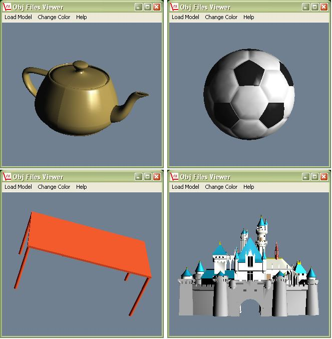



## OpenGL Viewer for 3D Models

### Description

This program reads, loads and views Wavefront .Obj files in OpenGL environment. To use OpenGL in the program I used the ‘glxCtl’ ActiveX control. This ActiveX control is a library to support higher level routines for OpenGL, handles the setup of OpenGL window and fires various events…. To run this program you need to download two files the ActiveX file ‘glxCtl.ocx v 1.4’ and VBOpenGL type library v 1.2 (VBOpenGL.tlb).

You can download ‘glxCtl.ocx v1.4’ from

http://home.pacific.net.hk/~edx/bin/glxctl14.zip

And the file ‘VBOpenGL.tlb’ from

http://home.pacific.net.hk/~edx/bin/vbogl12.zip

( The ActiveX was made by Edx for more information please check his website http://home.pacific.net.hk/~edx/)

After you download these files, put them in the ‘System32’ folder under Windows Folder. To use these files in Visual Basic you will need to register them.

Registering ‘VBOpenGL.tlb

Run visual basic and click on References in the Project Menu, in the Reference window browse for ‘VBOpenGL.tlb’ file and double click it.

Registering ‘glxCtl.ocx’

Again in the Project Menu, click on Components, in the Components-Controls window browse for ‘glxCtl.ocx’ and double click it.

Now the files are registered and you can run the program, I have included two .obj files (soccerball.obj and table.obj) to demonstrate the program. The class file I developed for reading the .obj files is very efficient and fast.

You can draw any model in any CAD environment, and then you should convert the file to .obj file format by using any converter software (e.g. Right Hemisphere’s Deep Exloration Software).

To rotate the model on the screen use the arrow keys, PageUP and PageDOWN. Keys ‘Z’ and ‘X’ zooms in and out.

I hope the program will be useful. I would appreciate your votes :))
 
### More Info
 

             |
---                |---
**Submitted On**   |2003-06-11 03:18:26
**By**             |[Anas S\. A\.](https://github.com/Planet-Source-Code/PSCIndex/blob/master/ByAuthor/anas-s-a.md)
**Level**          |Advanced
**User Rating**    |5.0 (40 globes from 8 users)
**Compatibility**  |VB 6\.0
**Category**       |[Graphics](https://github.com/Planet-Source-Code/PSCIndex/blob/master/ByCategory/graphics__1-46.md)
**World**          |[Visual Basic](https://github.com/Planet-Source-Code/PSCIndex/blob/master/ByWorld/visual-basic.md)
**Archive File**   |[Wavefront\_1599546102003\.zip](https://github.com/Planet-Source-Code/anas-s-a-opengl-viewer-for-3d-models__1-46102/archive/master.zip)

